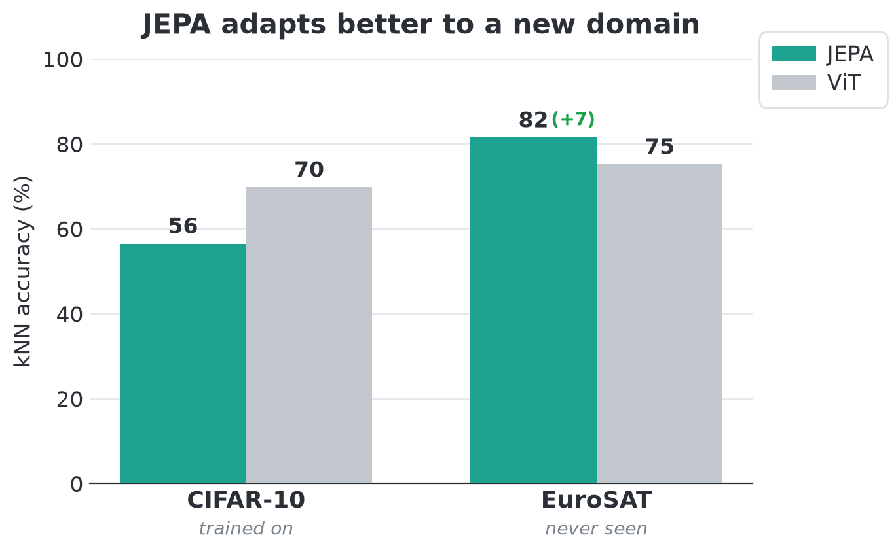
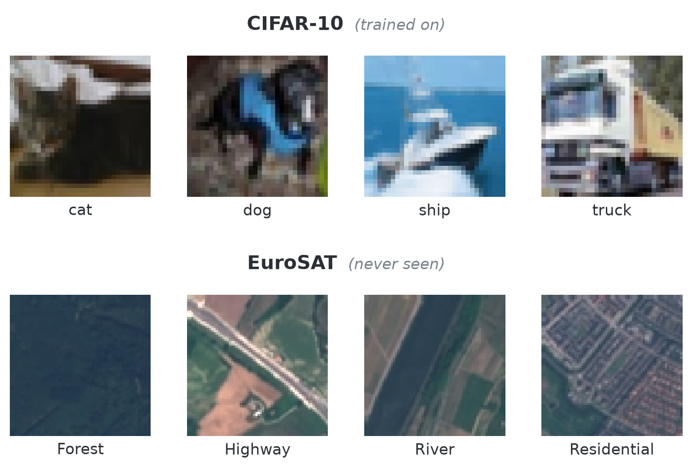

# JEPA from scratch

I trained I-JEPA from scratch on CIFAR-10, then trained a vanilla ViT as a baseline. After pretraining on CIFAR, I then evaluated both models on EuroSAT, an out-of-domain dataset of satellite imagery. Both models were evaluated with K nearest neighbors and also with a fine-tuned linear probe.

I-JEPA performed significantly worse on CIFAR, but was better than the supervised ViT on EuroSAT. This supports LeCun's claim that self-supervised learning with image embeddings produces superior representations to those from supervised learning.

However, I-JEPA was significantly trickier to train. Originally, my masking code wasn't obscuring enough of the image, leading to the model easily being able to predict the embeddings of these patches. I also did some tuning of the training. The ViT on the other hand worked well out of the box. It was super easy to train and didn't require much training compute or hyperparameter optimization. My takeaway from this is that if you are just training from scratch on a particular dataset, make your life easier and do supervised learning! However if you are looking to save on training compute, it's best to fine-tune a big self-supervised model.





JEPA (475 epochs)
ViT (25 epochs)
Linear probe trained 100 epochs on frozen features.

| | CIFAR-10 kNN | CIFAR-10 probe | EuroSAT kNN | EuroSAT probe |
|---|---:|---:|---:|---:|
| **JEPA** (frozen) | 56.5% | 69.0% | **81.5%** | **86.9%** |
| **Supervised ViT** (frozen) | **69.8%** | 69.9% | 75.2% | 84.0% |

## Reproduce

```bash
# self-supervised JEPA pretraining (2 GPUs)
PYTORCH_CUDA_ALLOC_CONF=expandable_segments:True \
  uv run torchrun --nproc_per_node=2 train.py

# supervised ViT baseline
uv run torchrun --nproc_per_node=2 train.py --baseline

# frozen-encoder eval (works on JEPA and ViT)
uv run python probe.py checkpoints/{checkpoint_name}.pt   --dataset cifar10 --epochs 100
```